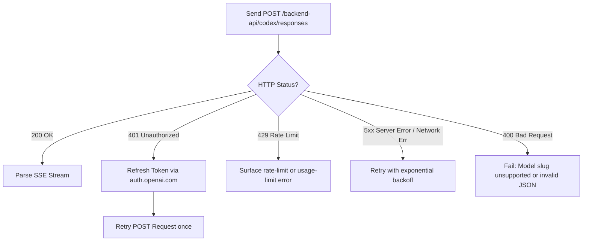

# Language-Agnostic Guide: Calling `https://chatgpt.com/backend-api/codex`

This guide specifies how to authenticate, format requests, and parse streaming responses for OpenAI's Codex backend API (`/backend-api/codex/responses`).

---

## 1. Authentication & Token Management

The Codex backend uses OAuth 2.0 with PKCE (Proof Key for Code Exchange) via OpenAI's authentication server.

### Constant Values
- **Issuer Base:** `https://auth.openai.com`
- **OAuth Client ID:** `app_EMoamEEZ73f0CkXaXp7hrann`
- **Originator ID:** `codex_cli_rs`
- **OAuth Scopes:** `openid profile email offline_access api.connectors.read api.connectors.invoke`

---

### Step 1.1: Authorization Request (PKCE)
1. Generate a **PKCE code verifier**: 64 random bytes encoded as URL-safe base64 without padding (`[A-Za-z0-9_-]`).
2. Generate the **code challenge**: Compute `SHA-256(code_verifier)` and encode as URL-safe base64 without padding.
3. Generate a random `state` token (e.g., 32 random bytes, base64url-encoded).
4. Start a local HTTP loopback server (e.g., `http://localhost:1455/auth/callback` or fallback `http://localhost:1457/auth/callback`).
5. Direct the user's browser to:
   ```
   GET https://auth.openai.com/oauth/authorize
     ?response_type=code
     &client_id=app_EMoamEEZ73f0CkXaXp7hrann
     &redirect_uri=http://localhost:1455/auth/callback
     &scope=openid profile email offline_access api.connectors.read api.connectors.invoke
     &code_challenge=<CODE_CHALLENGE>
     &code_challenge_method=S256
     &id_token_add_organizations=true
     &codex_cli_simplified_flow=true
     &state=<STATE>
     &originator=codex_cli_rs
   ```

---

### Step 1.2: Code Exchange
When the browser redirects back to the loopback server with `?code=<AUTH_CODE>&state=<STATE>`:
1. Verify `state` matches the initial value.
2. Exchange the code via `POST`:
   ```http
   POST https://auth.openai.com/oauth/token
   Content-Type: application/x-www-form-urlencoded

   grant_type=authorization_code&code=<AUTH_CODE>&redirect_uri=http://localhost:1455/auth/callback&client_id=app_EMoamEEZ73f0CkXaXp7hrann&code_verifier=<CODE_VERIFIER>
   ```
3. **Response Body (`application/json`):**
   ```json
   {
     "access_token": "<ACCESS_TOKEN>",
     "refresh_token": "<REFRESH_TOKEN>",
     "id_token": "<ID_TOKEN_JWT>"
   }
   ```
4. **Extract ChatGPT Account ID:**
   - Decode the payload segment of `id_token` (Base64URL JSON).
   - Read the claim `https://api.openai.com/auth` → `chatgpt_account_id`.

---

### Step 1.3: Token Refresh
Access tokens expire periodically. Refresh responses may rotate the refresh token:

```http
POST https://auth.openai.com/oauth/token
Content-Type: application/json

{
  "client_id": "app_EMoamEEZ73f0CkXaXp7hrann",
  "grant_type": "refresh_token",
  "refresh_token": "<CURRENT_REFRESH_TOKEN>"
}
```

> **Important:** If the response includes a new `refresh_token`, save it immediately. If it omits `refresh_token`, keep using the current one.

---

## 2. API Endpoint Specification

- **Endpoint:** `POST https://chatgpt.com/backend-api/codex/responses`
- **Protocol:** HTTP/1.1 or HTTP/2 over TLS
- **Transport Format:** Server-Sent Events (SSE)

### HTTP Headers

| Header | Value | Description |
| :--- | :--- | :--- |
| `Authorization` | `Bearer <access_token>` | OAuth Access Token |
| `ChatGPT-Account-ID` | `<account_id>` | *(Optional)* Account ID extracted from `id_token` |
| `originator` | `codex_cli_rs` | Client identifier expected by the backend |
| `session-id` | `<uuid-v7>` | Unique session identifier |
| `thread-id` | `<uuid-v7>` | Conversation/thread identifier |
| `Accept` | `text/event-stream` | Indicates stream consumption |
| `Content-Type` | `application/json` | Request payload format |
| `User-Agent` | `<client-name>/<version>` | Client identification |

---

## 3. Request Payload Schema

Unlike OpenAI's standard `/v1/chat/completions` endpoint, the Codex Responses API separates system prompts into top-level `instructions` and formats dialog turns into typed `input` arrays.

### JSON Structure

```json
{
  "model": "gpt-5.5",
  "instructions": "You are a helpful coding assistant.",
  "input": [
    {
      "type": "message",
      "role": "user",
      "content": [
        {
          "type": "input_text",
          "text": "Summarize this diff"
        }
      ]
    },
    {
      "type": "message",
      "role": "assistant",
      "content": [
        {
          "type": "output_text",
          "text": "Here is the summary..."
        }
      ]
    }
  ],
  "tools": [],
  "tool_choice": "auto",
  "parallel_tool_calls": false,
  "stream": true,
  "store": false,
  "include": ["reasoning.encrypted_content"],
  "prompt_cache_key": "<stable-session-id>",
  "client_metadata": {
    "x-codex-installation-id": "<persistent-installation-id>",
    "session_id": "<session-id>",
    "thread_id": "<thread-id>",
    "x-codex-window-id": "<window-id>"
  }
}
```

### Field Mapping Rules
- **Base Instructions:** Put the stable model/base prompt in root `instructions`. Omit it when empty. Do not rebuild it from every system or developer message on each turn.
- **Dynamic Instructions and Context:** Preserve their order and role in `input`. Codex commonly represents developer guidance as `role: "developer"` items and contextual guidance as `role: "user"` items.
- **User Messages:** `role: "user"`, `content[].type: "input_text"`.
- **Assistant Messages:** `role: "assistant"`, `content[].type: "output_text"`.
- **Completed Output Items:** Preserve each `response.output_item.done.item` as a typed item for the next request. Do not reconstruct history only from text deltas; doing so loses reasoning and tool-call state.
- **Reasoning State:** For stateless requests (`store: false`), request `reasoning.encrypted_content` and replay returned reasoning items on later turns.
- **Prompt Cache:** Keep `prompt_cache_key` stable for a conversation/session.

### Context Bounds

Conversation history must remain bounded. Track the selected model's context window, compact before the request would exceed it, and cap large tool outputs before storing or replaying them. Codex normally auto-compacts near 90% of the model context window and applies model-specific truncation limits to tool output.

---

## 4. Supported Models & Model Discovery

### Dynamic Model Listing

Discover the current Codex model catalog with:

```http
GET https://chatgpt.com/backend-api/codex/models?client_version=<client-version>
Authorization: Bearer <access-token>
ChatGPT-Account-ID: <account-id>
```

The response contains a `models` array. Use its visibility, priority, supported reasoning levels, and other capability fields to build the model picker and request configuration. Cache the response and its `ETag`. A Responses stream may return `X-Models-Etag`; refresh `/models` when that value differs from the cached catalog.

### Bundled Fallback Catalog

The current implementation bundles this fallback ordering for the main Codex models. Dynamic `/models` results are authoritative because availability may depend on client version and account:

| Model Slug | Status | Notes |
| :--- | :--- | :--- |
| `gpt-5.6-sol` | Listed, API-supported | Highest-priority bundled model |
| `gpt-5.6-terra` | Listed, API-supported | Balanced model |
| `gpt-5.6-luna` | Listed, API-supported | Fast model |
| `gpt-5.5` | Listed, API-supported | Older supported model |
| `gpt-5.4` | Hidden | Bundled migration points to `gpt-5.6-terra` |

### Validating an Explicit Model

Prefer `/models` for discovery. If a caller accepts an arbitrary explicit slug, a minimal Responses request remains the final availability check:

- **Supported Model:** The server responds with `HTTP 200 OK` and starts the `text/event-stream`.
- **Unsupported Model:** The server returns `HTTP 400 Bad Request` with a JSON error payload:
  ```json
  {
    "error": {
      "message": "The model `example-model` is not supported.",
      "type": "invalid_request_error",
      "param": "model",
      "code": "model_not_supported"
    }
  }
  ```

---

## 5. Response Handling (SSE Stream)

The server responds with `Content-Type: text/event-stream`. Each chunk follows standard SSE syntax (`event: ...`, `data: ...`).

### Server-Sent Events Example

```
event: response.output_text.delta
data: {"type":"response.output_text.delta","delta":"feat: add"}

event: response.output_text.delta
data: {"type":"response.output_text.delta","delta":" logging"}

event: response.completed
data: {"type":"response.completed","response":{"id":"resp_123"}}
```

### Event Dispatch Table

| Event `type` | Payload Key | Action |
| :--- | :--- | :--- |
| `response.created` | `response` (object) | Record response start |
| `response.output_text.delta` | `delta` (string) | Append text for live display only |
| `response.output_item.added` | `item` (object) | Record time-to-first-output and provisional item state |
| `response.output_item.done` | `item` (object) | Parse and retain the complete typed output item for history |
| `response.custom_tool_call_input.delta` | `delta`, `item_id`, `call_id` | Stream custom tool-call input |
| `response.reasoning_summary_text.delta` | `delta`, `summary_index` | Stream reasoning summary text |
| `response.reasoning_summary_text.done` | `text`, `item_id`, `summary_index` | Finalize reasoning summary text |
| `response.reasoning_text.delta` | `delta`, `content_index` | Stream reasoning content when present |
| `response.completed` | `response` (object) | Record response ID/usage and stop reading |
| `response.failed` | `response.error.message` | Stop reading and raise error with message |
| `response.incomplete` | `response.incomplete_details.reason` | Raise an incomplete-response error |

The SSE `event:` name and JSON `type` normally match. Dispatch using the JSON `type`. A valid turn may contain only typed output items, such as a tool call, and no text delta.

---

## 6. Error Handling & Resilience Strategy



1. **HTTP 401 Unauthorized:** Refresh access token using `grant_type=refresh_token`, update stored credentials, and retry the request once.
2. **HTTP 429 Too Many Requests:** Codex does not retry transport-level 429 responses automatically. Surface the mapped rate-limit or usage-limit error. For an SSE `response.failed` with `rate_limit_exceeded`, parse any retry delay from the error and apply the stream retry policy.
3. **HTTP 5xx / Network Errors:** The default request policy permits up to 4 retries with exponential jitter from a 200 ms base delay. The default stream reconnection budget is 5 retries. Both values are provider-configurable and capped.
4. **Early Stream Close:** If the stream ends before `response.completed`, treat it as a stream error and reconnect within the stream retry budget.
5. **Empty Completed Responses:** `response.completed` is valid even when no text or output item was emitted. Do not fail solely because aggregated text is empty.
